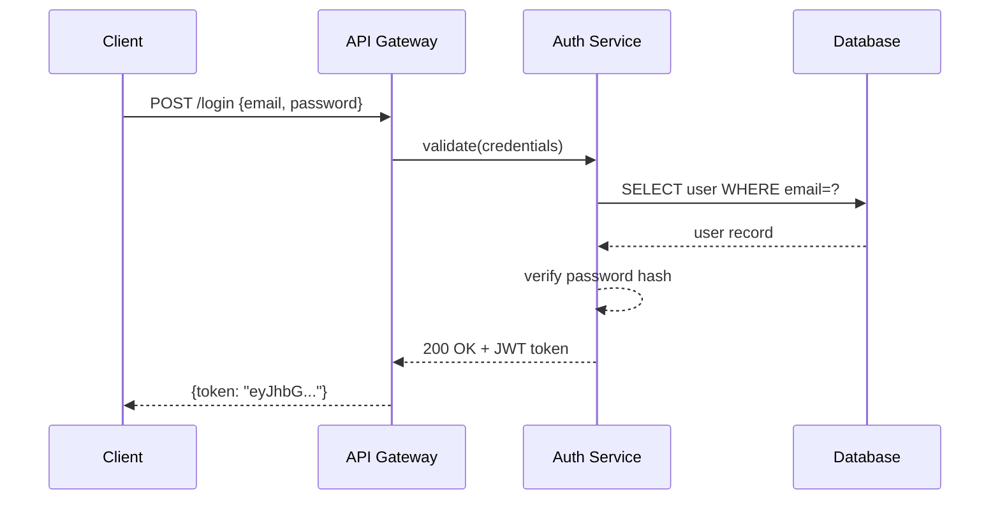
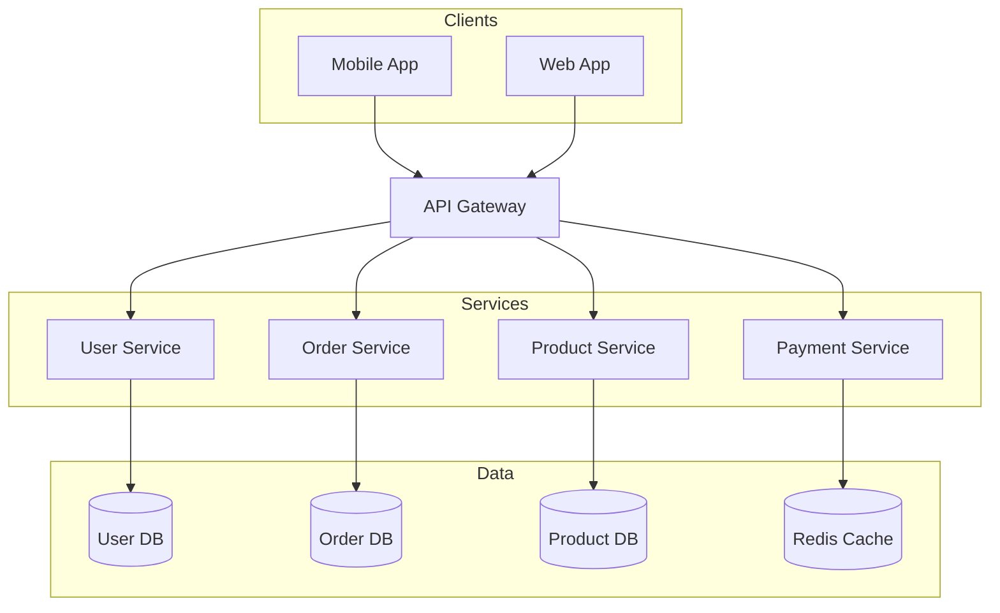
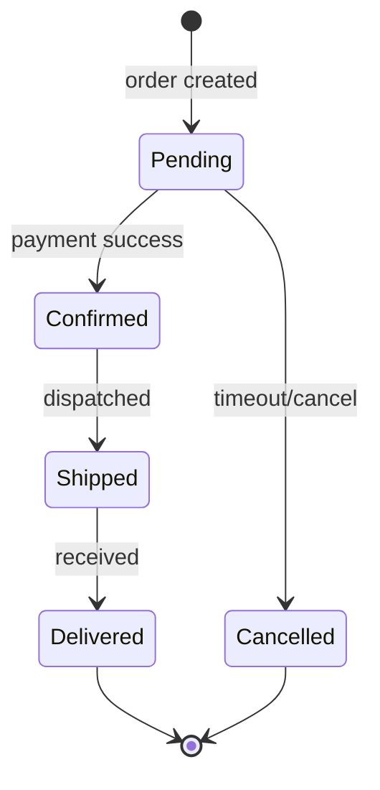

# Mermaid Diagrams

Generate `.mmd` text files and export to PNG/SVG/PDF using `mmdc` (local) or Kroki API (no install).

**Key advantage:** Text-based syntax with **fully automatic layout** — no x/y coordinates needed.

## Prerequisites

**Option A: Local (mmdc)**
```bash
npm install -g @mermaid-js/mermaid-cli
mmdc --version
```

**Option B: Kroki API (no install)**
```bash
curl --version  # Just need curl
```

## Workflow

1. **Check deps** — try `mmdc --version`, fallback to Kroki if unavailable
2. **Pick diagram type** — choose from table below
3. **Generate** — write `.mmd` file to disk
4. **Validate** — run validation (REQUIRED before export)
5. **Export** — use `mmdc` or Kroki API to produce PNG/SVG/PDF
6. **Report** — tell user the output file paths

## Validation (Required)

**NEVER export a diagram without validating first.**

```bash
# Validate with mmdc (local)
mmdc -i diagram.mmd -o /tmp/test.png 2>&1

# Validate with Kroki (if mmdc unavailable)
curl -s -X POST -H "Content-Type: text/plain" --data-binary @diagram.mmd https://kroki.io/mermaid/svg -o /tmp/test.svg && echo "Valid" || echo "Invalid"

# If error, fix the .mmd file and validate again
# Only proceed to export after validation passes
```

Common validation errors:
- Missing quotes around labels with special characters
- Wrong arrow syntax (use `->>` for sequence, `-->` for flowchart)
- Undeclared participants in sequence diagrams

## Diagram Types

| Type | Keyword | Use for |
|------|---------|---------|
| Flowchart | `flowchart TD/LR` | processes, pipelines, decisions |
| Sequence | `sequenceDiagram` | API calls, message passing |
| Class | `classDiagram` | OOP models, data structures |
| ER | `erDiagram` | database schemas |
| State | `stateDiagram-v2` | state machines, lifecycle |
| Gantt | `gantt` | project timelines |
| Pie | `pie` | proportions |
| Git Graph | `gitGraph` | branch strategies |
| C4 Context | `C4Context` | high-level architecture |
| Mind Map | `mindmap` | topic breakdowns |

## Syntax Reference

**Flowchart**: See [reference/FLOWCHART.md](reference/FLOWCHART.md)
**Sequence**: See [reference/SEQUENCE.md](reference/SEQUENCE.md)
**Class & ER**: See [reference/CLASS-ER.md](reference/CLASS-ER.md)
**Other types**: See [reference/OTHER-TYPES.md](reference/OTHER-TYPES.md)

## Examples

### Example 1: API Authentication Flow

**User prompt:**
> Create a sequence diagram for JWT authentication

**Generated `.mmd`:**


**Output files:** `auth-flow.mmd` + `auth-flow.png`

---

### Example 2: Microservices Architecture

**User prompt:**
> Draw an e-commerce microservices architecture

**Generated `.mmd`:**


**Output files:** `ecommerce-arch.mmd` + `ecommerce-arch.png`

---

### Example 3: Order State Machine

**User prompt:**
> Show order lifecycle states

**Generated `.mmd`:**


**Output files:** `order-states.mmd` + `order-states.png`

## Export Commands

### Option 1: Local Export (mmdc)

Requires `mmdc` installed locally. Best for offline use.

```bash
# PNG (recommended: 2048px wide, white background)
mmdc -i diagram.mmd -o diagram.png -w 2048 --backgroundColor white

# PNG with theme (default | dark | neutral | forest | base)
mmdc -i diagram.mmd -o diagram.png -w 2048 --backgroundColor white --theme neutral

# SVG
mmdc -i diagram.mmd -o diagram.svg

# PDF
mmdc -i diagram.mmd -o diagram.pdf
```

### Option 2: Kroki API (No Install Required)

Use [Kroki](https://kroki.io) when `mmdc` is not available. No local dependencies needed.

```bash
# SVG via Kroki
curl -X POST -H "Content-Type: text/plain" --data-binary @diagram.mmd https://kroki.io/mermaid/svg -o diagram.svg

# PNG via Kroki
curl -X POST -H "Content-Type: text/plain" --data-binary @diagram.mmd https://kroki.io/mermaid/png -o diagram.png

# PDF via Kroki
curl -X POST -H "Content-Type: text/plain" --data-binary @diagram.mmd https://kroki.io/mermaid/pdf -o diagram.pdf
```

**Kroki advantages:**
- No local installation required
- Works on any system with `curl`
- Supports 20+ diagram types (PlantUML, GraphViz, D2, etc.)

**When to use Kroki:**
- `mmdc` installation fails
- Quick one-off diagrams
- CI/CD pipelines without Node.js

## Common Mistakes

| Mistake | Fix |
|---------|-----|
| `mmdc` not found | `npm install -g @mermaid-js/mermaid-cli` |
| Wrong arrow in sequence | Use `->>` for request, `-->>` for response |
| Special chars in label | Wrap in quotes: `A["Label: value"]` |
| Blank/small output | Add `-w 2048` flag |
| Participant order wrong | Declare `participant` explicitly at top |
| Subgraph name with spaces | Wrap in quotes: `subgraph "My Layer"` |
