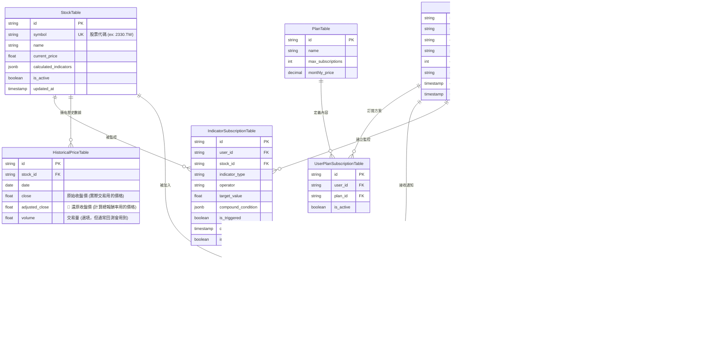

```mermaid
erDiagram
    %% 身份與認證模組 (🌟 新增 OAuth 支援)
    UserTable {
        string id PK
        string email UK "主要聯繫與歸戶用"
        string displayName
        string pictureUrl
        int quota "可用額度"
        string subscription_status "方案狀態"
        timestamp created_at
        timestamp updated_at
    }

    OAuthAccountTable {
        string id PK
        string user_id FK "關聯回UserTable"
        string provider "google, line"
        string provider_user_id UK "第三方平台的唯一UID"
        string access_token "選填，視需求加密儲存"
        string refresh_token "選填，視需求加密儲存"
        timestamp expires_at
        timestamp created_at
    }

    %% 用戶與清單模組
    WatchListTable {
        string id PK
        string name "清單名稱"
        string user_id FK
        timestamp created_at
    }

    %% 股票數據模組
    StockTable {
        string id PK
        string symbol UK "股票代碼 (ex: 2330.TW)"
        string name
        float current_price
        jsonb calculated_indicators
        boolean is_active
        timestamp updated_at
    }

    HistoricalPriceTable {
        string id PK
        string stock_id FK
        date date
        float close "原始收盤價 (實際交易用的價格)"
        float adjusted_close "🌟 還原收盤價 (計算總報酬率用的價格)"
        float volume "交易量 (選填，但通常回測會用到)"
    }

    WatchListStockTable {
        string id PK
        string watch_list_id FK
        string stock_id FK
    }

    %% 訂閱與通知模組
    IndicatorSubscriptionTable {
        string id PK
        string user_id FK
        string stock_id FK
        string indicator_type
        string operator
        float target_value
        jsonb compound_condition
        boolean is_triggered
        timestamp cooldown_end_at
        boolean is_active
    }

    NotificationHistoryTable {
        string id PK
        string user_id FK
        string indicator_subscription_id FK
        float triggered_value
        string send_status
        string line_message_id
        timestamp triggered_at
    }

    %% 計費模組
    PlanTable {
        string id PK
        string name
        int max_subscriptions
        decimal monthly_price
    }

    UserPlanSubscriptionTable {
        string id PK
        string user_id FK
        string plan_id FK
        boolean is_active
    }

    %% 關聯定義 (Relationships)
    UserTable ||--o{ OAuthAccountTable : "擁有多個認證方式"
    UserTable ||--o{ WatchListTable : "擁有"
    UserTable ||--o{ IndicatorSubscriptionTable : "建立監控"
    UserTable ||--o{ NotificationHistoryTable : "接收通知"
    UserTable ||--o{ UserPlanSubscriptionTable : "訂閱方案"

    PlanTable ||--o{ UserPlanSubscriptionTable : "定義內容"

    WatchListTable ||--o{ WatchListStockTable : "包含"
    StockTable ||--o{ WatchListStockTable : "被加入"

    StockTable ||--o{ HistoricalPriceTable : "擁有歷史數據"
    StockTable ||--o{ IndicatorSubscriptionTable : "被監控"

    IndicatorSubscriptionTable ||--o{ NotificationHistoryTable : "觸發"
```
